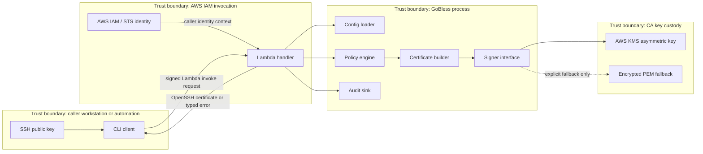

# GoBless Architecture

GoBless is a Go implementation of a BLESS-compatible serverless SSH certificate authority. It issues short-lived OpenSSH certificates from AWS Lambda after IAM-authenticated invocation and policy validation.

## System overview



## Components and responsibilities

### Signer interface

The signer interface is the only component allowed to perform CA signing. Implementations must expose signing and public-key export without exposing private key material.

Responsibilities:
- Sign certificate wire data using the configured CA key.
- Export the CA public key in OpenSSH-authorized-key format.
- Hide KMS and PEM details behind a small internal interface.
- Return typed errors that do not include key material, plaintext request bodies containing secrets, or provider-specific sensitive metadata.

Default implementation: AWS KMS asymmetric signing. Encrypted PEM is an explicit fallback for development, migration, or deployments that cannot use KMS.

### Certificate builder

The certificate builder converts a validated signing request into an `ssh.Certificate`.

Responsibilities:
- Parse and validate the submitted SSH public key.
- Build user and host certificates with approved principals, extensions, critical options, TTL, valid-after, valid-before, serial, and key ID.
- Enforce OpenSSH wire-format constraints and deterministic field mapping.
- Generate random 64-bit serials and KeyIDs containing timestamp plus random suffix for audit correlation.

The builder does not decide whether a principal is allowed; it only consumes policy-approved inputs.

### Policy engine

The policy engine is the authorization decision point.

Responsibilities:
- Treat all request-body fields as untrusted.
- Bind IAM caller identity to requested user principals by default.
- Validate requested principals against allowlist policy.
- Validate host certificate authorization separately from user certificate authorization.
- Enforce maximum TTL, allowed critical options, allowed extensions, source-address restrictions, force-command restrictions, and explicit override rules.
- Reject malformed, ambiguous, Unicode-confusable, or duplicate principals.

### Lambda handler

The Lambda handler is the request/response adapter.

Responsibilities:
- Receive direct Lambda invocation events compatible with BLESS-style clients.
- Extract trusted AWS caller identity from invocation context or configured identity metadata.
- Decode request JSON into internal request types.
- Call config, policy, certificate builder, signer, and audit components in order.
- Return BLESS-compatible success responses and stable, non-secret error responses.

The handler must not make authorization decisions inline except for syntactic request rejection before policy evaluation.

### Config

Config defines compatibility behavior and deployment policy.

Responsibilities:
- Load BLESS-compatible configuration keys and GoBless-native equivalents.
- Validate required keys at startup/init, including CA mode, allowed principals, TTL ceilings, allowed critical options, audit backend, and compatibility flags.
- Fail closed when config is missing, ambiguous, or allows unsafe production behavior without an explicit opt-in.
- Surface production warnings for encrypted PEM mode.

### Audit

Audit records every certificate decision, successful or rejected.

Responsibilities:
- Emit structured audit events containing request ID, AWS caller identity, certificate type, public-key fingerprint, requested principals, approved principals, TTL, KeyID, serial, source address, decision, reason code, and signer backend.
- Redact secrets and avoid logging private key material, decrypted PEM, credentials, or complete request payloads that might contain secrets.
- Make audit failures explicit. Production policy should fail closed unless configured otherwise for a documented emergency mode.

### CLI client

The CLI client is the user-facing request tool.

Responsibilities:
- Read or generate the SSH public key to certify.
- Discover caller identity through AWS credentials used to invoke Lambda.
- Submit BLESS-compatible request shapes for user and host certificates.
- Print returned OpenSSH certificates and CA public keys.
- Avoid storing secrets or certificates longer than needed.

## Trust boundaries

| Boundary | Trusted inside | Untrusted outside | Security rule |
| --- | --- | --- | --- |
| Caller workstation | User keypair, local CLI arguments | Local shell environment, filesystem, request body | Server must validate every requested principal and option. |
| AWS IAM invocation | AWS-authenticated principal and invocation authorization | Request JSON fields claiming usernames, hosts, TTL, IPs | IAM allows invocation; policy authorizes certificate contents. |
| GoBless process | Internal validated request objects | Lambda event payload and environment strings before validation | Decode, validate, and normalize before use. |
| CA key custody | KMS private key or decrypted PEM during signing | Lambda logs, audit events, request/response data | Private key must never be serialized or logged; prefer KMS. |
| Audit backend | Append-only audit records and backend IAM controls | Caller-controlled request content | Audit must record decisions with redacted, normalized fields. |

## Dependency tree

```text
Lambda handler
├── Config loader
├── Request decoder
├── Policy engine
│   └── Config policy data
├── Certificate builder
│   ├── Random source: crypto/rand
│   └── SSH primitives: golang.org/x/crypto/ssh
├── Signer interface
│   ├── KMS signer: AWS SDK v2 KMS client
│   └── Encrypted PEM signer: crypto/x509 + encoding/pem + ssh primitives
└── Audit sink
    ├── Structured event formatter
    └── Backend implementation, for example DynamoDB via AWS SDK v2

CLI client
├── AWS Lambda invoke client: AWS SDK v2 Lambda client
├── SSH key parsing: golang.org/x/crypto/ssh
└── Output formatting
```

No component may import a concrete AWS client except AWS adapter packages. Core policy and certificate construction must be testable without AWS.

## Key flows

### User certificate request

1. CLI reads the user's SSH public key and invokes the Lambda using AWS credentials.
2. Lambda receives the event and obtains the trusted AWS caller identity from IAM/invocation context.
3. Handler decodes request body and rejects malformed JSON or unsupported request type.
4. Config loader supplies policy and compatibility settings.
5. Policy engine validates:
   - requested certificate type is `user`;
   - requested username principal matches the AWS caller username/ARN mapping unless policy explicitly overrides it;
   - all principals are in the allowlist and are canonical ASCII-safe values;
   - TTL is within configured maximum;
   - critical options and extensions are allowed.
6. Certificate builder constructs an OpenSSH user certificate with random serial and audit KeyID.
7. Signer signs through KMS by default, or encrypted PEM only when explicitly configured.
8. Audit sink records success or failure with reason code and correlation fields.
9. Handler returns the OpenSSH certificate or a stable error response.

### Host certificate request

1. Authorized automation or host bootstrap process invokes Lambda with AWS credentials.
2. Lambda obtains trusted IAM caller identity.
3. Policy engine validates the caller is allowed to request host certificates.
4. Policy validates requested host principals against configured host allowlists, instance identity rules, or explicit mappings.
5. Certificate builder emits an OpenSSH host certificate with approved host principals, TTL, KeyID, and random serial.
6. Signer signs the certificate.
7. Audit records caller identity, host principals, public-key fingerprint, KeyID, serial, and decision.
8. Handler returns the host certificate.

User-principal binding rules do not automatically authorize host certificates. Host authorization must be configured separately.

### CA public key export

1. CLI invokes the public-key export operation or reads a published CA public key artifact.
2. Lambda handler authorizes the operation according to config. Public export may be allowed broadly, but invocation still uses IAM unless another distribution path is configured.
3. Signer returns only the CA public key.
4. Handler formats the key as an OpenSSH authorized key line.
5. Audit records export operation without certificate fields.

Private CA key material is never returned by this flow.
